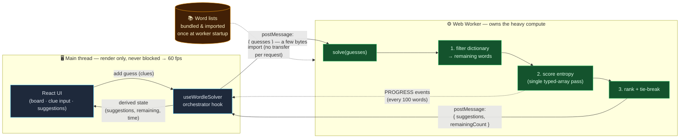

# 🧩 Wordle Solver Bot

> **An information-theoretic Wordle solver.** For every legal guess it computes the
> expected information gain (in bits) and recommends the word that, on average,
> eliminates the most possibilities.
>
> Built with Next.js 16, React 19 and a Web Worker so the UI stays at 60 fps while
> thousands of words are scored.

[](https://github.com/P4ST4S/next-wordle-bot/actions/workflows/ci.yml)
[](https://codecov.io/gh/P4ST4S/next-wordle-bot)


## 📖 About

Enter the guesses you have already played and the colors Wordle gave back; the
solver replies with a ranked list of next words. Each suggestion shows its
**Shannon entropy** (how much it is expected to narrow the search) and the
**expected number of words remaining** after playing it.

The whole thing runs client-side: the word lists (a 12,972-word dictionary,
referred to as "~13k" throughout) are bundled into the app and all scoring happens
in a Web Worker, so there is no backend and no network round-trip during a game.

## ✨ Key Features

- **🧠 Information-theory ranking** — expected information gain (bits) for every
  candidate, with a deterministic tie-break that prefers words which can still be
  the answer.
- **⚡ Off-main-thread compute** — filtering and entropy scoring run in a Web
  Worker; the main thread never iterates the ~13k-word dictionary, keeping input
  responsive.
- **🔬 Allocation-free hot loop** — words are encoded into typed arrays and each
  guess is scored in a single pass (no per-call `split`/`Map`/object churn).
- **🧪 Tested core** — the solving pipeline is pure, shared between the worker and
  the test suite, and covered by Vitest (incl. an end-to-end "solve real words"
  golden test).
- **🎨 Modern UI** — Tailwind CSS v4 + Radix primitives, fully responsive, dark
  mode.

## 🛠️ Tech Stack

| Concern        | Choice                                                          |
| -------------- | -------------------------------------------------------------- |
| Framework      | [Next.js 16](https://nextjs.org/) (App Router, Turbopack)      |
| UI library     | [React 19.2](https://react.dev/) + React Compiler              |
| Language       | [TypeScript 5.9](https://www.typescriptlang.org/) (strict)     |
| Styling        | [Tailwind CSS v4](https://tailwindcss.com/)                    |
| Components     | [Radix UI](https://www.radix-ui.com/) primitives (shadcn-style)|
| Icons          | [Lucide](https://lucide.dev/)                                  |
| Concurrency    | Web Workers API (module worker)                                |
| Testing        | [Vitest](https://vitest.dev/)                                  |

## 🚀 Getting Started

### Prerequisites

- **Node.js 20.9+** (required by Next.js 16)
- **pnpm** (recommended)

### Installation

```bash
git clone https://github.com/P4ST4S/next-wordle-bot.git
cd next-wordle-bot
pnpm install
pnpm dev          # http://localhost:3000
```

### Scripts

| Command           | Description                                  |
| ----------------- | -------------------------------------------- |
| `pnpm dev`        | Start the dev server (Turbopack)             |
| `pnpm build`      | Production build                             |
| `pnpm start`      | Serve the production build                   |
| `pnpm test`       | Run the Vitest suite once                    |
| `pnpm test:watch` | Run Vitest in watch mode                     |
| `pnpm lint`       | Lint with ESLint                             |

## 🧮 How It Works

Every guess produces one of **3⁵ = 243** color patterns (each tile is gray /
yellow / green). The solver treats "which pattern will I see?" as a random
variable and picks the guess whose answer is **least predictable** — i.e. the one
that splits the remaining candidates most evenly.

For a guess `w` against the set of remaining answers, it groups the answers by the
pattern they would produce and computes the Shannon entropy of that distribution:

$$E[I]=\sum_{p} P(p)\cdot\log_2\frac{1}{P(p)}$$

where $P(p)$ is the fraction of remaining answers that yield pattern $p$. Higher
entropy ⇒ more information ⇒ a faster narrowing of the search space.

Pipeline per turn (see [`lib/logic/solver.ts`](lib/logic/solver.ts)):

1. **Filter** — reduce the dictionary to words consistent with every clue so far
   (handles duplicate letters and exact counts correctly).
2. **Pick candidates** — the remaining words, plus a few extra dictionary probes
   when the set is small.
3. **Score** — entropy + expected-remaining for each candidate in one typed-array
   pass. (If thousands of words still match, a fast letter-frequency heuristic is
   used to stay interactive.)
4. **Rank** — sort by entropy, breaking ties toward words that could win outright.

> **Strategy note:** this is a greedy, depth-1 entropy maximizer — strong and fast,
> but not a provably optimal multi-step solver. A pathological double-letter word
> like `jazzy` may take an extra guess. See
> [`docs/ARCHITECTURE.md`](docs/ARCHITECTURE.md) for the trade-offs.

## 📂 Project Structure

```
├── app/                # Next.js App Router (single client page + layout)
├── components/
│   ├── solver/         # Board, clue input, suggestions, stats, controls
│   └── ui/             # Reusable primitives (button, card, table, …)
├── hooks/              # useWordleSolver (orchestrator), useGameState, useWorker
├── lib/
│   ├── logic/          # Pure solving logic + Vitest specs (*.test.ts)
│   ├── data/           # Bundled word lists (imported, not fetched)
│   └── types/          # Shared TypeScript types
└── workers/            # Web Worker that runs the shared solver logic
```

> The solving logic lives in [`lib/logic/solver.ts`](lib/logic/solver.ts) and is
> imported by **both** the Web Worker and the tests — there is no duplicated logic
> between threads.

## 📐 Architecture & the 60 fps guarantee

The UI thread never does heavy work. Its only jobs are rendering and posting a
tiny message to the worker; **all** of the expensive work — filtering ~13k words
and scoring entropy over 243 patterns — happens on a separate thread. Because the
main thread is never blocked, the browser keeps hitting its 16.7 ms frame budget,
so animations and input stay at a constant 60 fps even mid-calculation.

> **Measured, not asserted:** the worker-side `solve()` runs in **~0.7 ms** after
> the first guess (≈39 candidates) and stays sub-millisecond as the set shrinks;
> a full round-trip including `postMessage` and re-render reports **~5 ms** in the
> browser. No long task (>50 ms) is registered on the main thread, so the frame
> loop is never starved.



**Why it stays smooth — three deliberate decisions:**

1. **All compute is off-main-thread.** `useGameState` no longer filters the
   dictionary on the UI thread; the worker is the single source of truth for the
   remaining-word count and suggestions. The main thread does O(1) work per guess.
2. **The dictionary never crosses the wire per request.** It is `import`-ed into
   the worker once at startup (a one-time bundle cost, not free — the trade is
   initial weight for synchronous availability and no runtime `fetch`), so a
   `solve` call ships only the handful of guesses (a few bytes) instead of
   structured-cloning ~150 KB of strings every turn.
3. **The hot loop is allocation-free.** Words are encoded into a flat
   `Uint8Array` and each guess is scored in one pass with a reusable
   `Int32Array(243)` — no `split`, `Map`, or object allocation per comparison — so
   the worker finishes in single-digit milliseconds and rarely needs to report
   progress at all.

A full deep dive — data flow, threading model, the entropy math and its
typed-array implementation, performance trade-offs, and the testing strategy —
lives in **[`docs/ARCHITECTURE.md`](docs/ARCHITECTURE.md)**.

## 🧪 Testing

```bash
pnpm test
```

The pure logic is covered by Vitest:

- **Pattern matching** — base-3 encoding, duplicate-letter edge cases.
- **Constraint filtering** — min/exact letter counts, wrong-position rules.
- **Entropy** — the typed-array scorer is cross-checked against a reference
  implementation for bit-for-bit agreement.
- **Golden / end-to-end** — full games are played against real answers to pin the
  solver's behavior and guard against regressions.

## 📄 License

MIT — see [LICENSE](LICENSE).

---

Built with ❤️ by [Antoine Rospars](https://github.com/P4ST4S)
