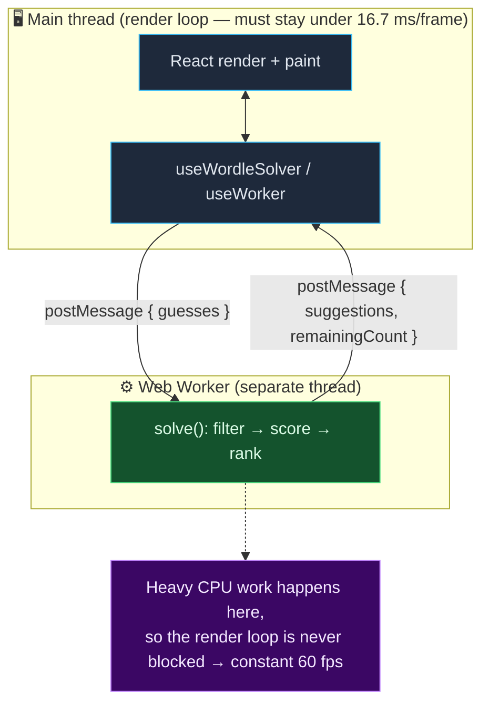
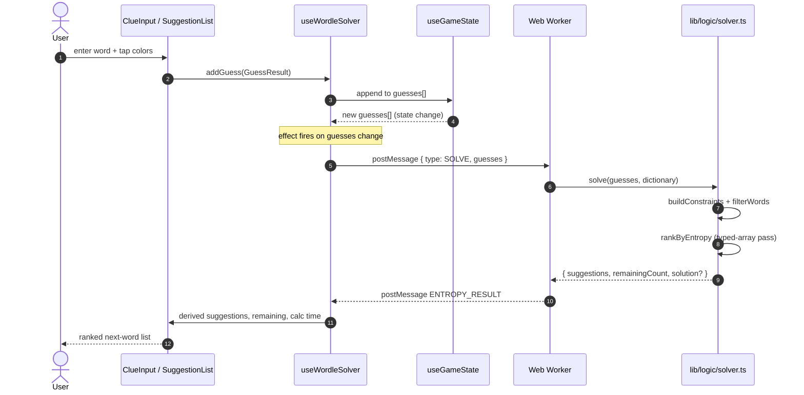

# Architecture & Engineering Notes

> A guided tour of how the Wordle Solver is built, the decisions behind it, and
> the trade-offs. Written for engineers and technical reviewers — it assumes you
> can read TypeScript but not that you know the codebase.

## Table of contents

1. [System overview](#1-system-overview)
2. [The threading model & why 60 fps is constant](#2-the-threading-model--why-60-fps-is-constant)
3. [Data flow of a single turn](#3-data-flow-of-a-single-turn)
4. [The algorithm: information theory](#4-the-algorithm-information-theory)
5. [Performance engineering](#5-performance-engineering)
6. [Module map](#6-module-map)
7. [State management](#7-state-management)
8. [Testing strategy](#8-testing-strategy)
9. [Trade-offs & what I would do next](#9-trade-offs--what-i-would-do-next)

---

## 1. System overview

The app is a **single client-rendered page** (no backend). You type the guesses
you have already played plus the colors Wordle returned; the app replies with a
ranked list of next words, each annotated with its Shannon entropy and the
expected number of candidates remaining after playing it.

Two design principles drive everything:

- **One source of truth for the logic.** The entire solving pipeline is a set of
  pure functions in [`lib/logic/`](../lib/logic). The Web Worker and the test
  suite import the *same* code — there is no second, drifting copy living inside
  the worker.
- **The UI thread only renders.** Every expensive computation runs on a worker
  thread, so the main thread is free to paint frames.

Tech: Next.js 16 (App Router, Turbopack), React 19.2 (+ React Compiler),
TypeScript 5.9 strict, Tailwind v4, Vitest.

---

## 2. The threading model & why 60 fps is constant

A browser tab renders on a single thread. To show 60 frames per second it must
finish each frame in **~16.7 ms**; if JavaScript occupies that thread for longer,
frames are dropped and the UI janks. Scoring ~13k candidate words against the
243 possible feedback patterns is far more than 16.7 ms of work, so doing it on
the main thread would stutter every interaction.

The fix is structural: that work lives on a **Web Worker**, a genuinely separate
OS thread.



Three reinforcing decisions keep the main thread idle:

| Decision | Without it | With it |
| --- | --- | --- |
| **Filtering moved into the worker** | `useGameState` filtered ~13k words on every guess, on the UI thread | Main thread does O(1) work per guess; the worker returns `remainingCount` |
| **Dictionary bundled into the worker** | ~150 KB of strings structured-cloned over `postMessage` *every* turn | Worker `import`s the lists once at startup; a request ships only the guesses (a few bytes) |
| **Allocation-free scoring** | per-comparison `split('')`, `Map`, object churn → GC pauses | flat `Uint8Array` + reusable `Int32Array(243)`; scoring finishes in single-digit ms |

The net effect, observed in the browser: a mid-game turn reports **~5 ms**
compute time, the main thread is never blocked, and input/animations stay at
60 fps. Because results arrive so fast, the progress bar (wired up for the rare
large-candidate case) usually never even shows.

> **Cancellation** is cooperative: a `CANCEL` message bumps a generation counter
> the worker checks between progress batches, so an in-flight calculation can be
> abandoned **without** tearing down the worker (which would discard the bundled
> dictionary and force a cold restart).

---

## 3. Data flow of a single turn



Note what the main thread does in that whole sequence: append to an array, post a
message, and later set one piece of state from the reply. Everything between steps
8 and 11 is on the worker.

---

## 4. The algorithm: information theory

### Patterns as a base-3 number

Each of the 5 tiles is gray (`0`), yellow (`1`), or green (`2`), so a full
response is a base-3 number in `[0, 242]` — 243 possibilities. Encoding it as a
single integer makes "group answers by the pattern they'd produce" a cheap array
index instead of a string key.

`computePattern(guess, actual)` ([`pattern-matching.ts`](../lib/logic/pattern-matching.ts))
uses the standard **two-pass** rule so duplicate letters are scored exactly like
real Wordle: greens are assigned first and remove those letters from the pool,
then yellows are drawn from whatever letters are left. (This is the subtle part
most naive solvers get wrong — e.g. guessing `eevee` against `level`.)

### Entropy = expected information gain

For a candidate guess `w`, partition the remaining answers by the pattern each
would produce. If a pattern `p` covers a fraction `P(p)` of the remaining set, the
expected information gained by playing `w` is its Shannon entropy:

```
E[I] = Σ  P(p) · log₂( 1 / P(p) )
       p
```

Intuition: a guess that shatters the candidate set into many small, equally-likely
buckets has high entropy and is a great probe; a guess that usually returns the
same pattern teaches you little. We also report **expected remaining** =
`Σ P(p)·count(p)`, the average number of candidates left after the guess, which is
the more human-readable face of the same distribution.

### Ranking & tie-break

Suggestions are sorted by entropy descending. Exact ties are broken
**deterministically**: prefer a word that is itself still a possible answer (it
might win outright), then fall back to alphabetical order. The alphabetical
fallback also makes results reproducible regardless of floating-point summation
order — important so the golden tests are stable.

---

## 5. Performance engineering

The naive scorer recomputed `computePattern` twice per candidate (once for
entropy, once for expected-remaining), each call doing `string.split('')`,
`Array.indexOf`, and `Map` mutations — i.e. thousands of allocations per turn.
The current implementation in
[`entropy-calculation.ts`](../lib/logic/entropy-calculation.ts) removes that
overhead:

- **Encode once.** `encodeWords` packs every word into a flat `Uint8Array` (5
  bytes per word, letters as `0–25`). Comparisons are then byte math, no strings.
- **One pass, two metrics.** `scoreGuessEncoded` builds the pattern histogram a
  single time and derives both entropy and expected-remaining from it.
- **No per-call allocation.** Pattern counts live in a reusable `Int32Array(243)`
  that is `fill(0)`-reset per candidate; the duplicate-handling scratch buffers
  are module-level and reused. The result is a tight numeric loop the JIT can
  optimize well.

A correctness net guards the rewrite: a Vitest spec cross-checks the typed-array
scorer against a straightforward `Map`-based reference for bit-for-bit identical
entropy on tricky inputs.

When **thousands** of words still match (e.g. right after the opener), exact
entropy over the full candidate set would be wasteful, so the solver falls back to
a cheap **letter-frequency heuristic** to stay interactive, switching to exact
entropy once the set is small (`HEURISTIC_THRESHOLD` in
[`solver.ts`](../lib/logic/solver.ts)).

---

## 6. Module map

| Path | Responsibility |
| --- | --- |
| [`lib/logic/solver.ts`](../lib/logic/solver.ts) | **The pipeline.** `solve(guesses, dictionary)` → filter, pick candidates, score, rank. Shared by the worker and tests. |
| [`lib/logic/pattern-matching.ts`](../lib/logic/pattern-matching.ts) | `computePattern` and base-3 encode/decode helpers. |
| [`lib/logic/entropy-calculation.ts`](../lib/logic/entropy-calculation.ts) | Typed-array entropy scoring (`encodeWords`, `scoreGuessEncoded`, `rankByEntropyEncoded`). |
| [`lib/logic/word-filtering.ts`](../lib/logic/word-filtering.ts) | Turn clues into `WordConstraints` and filter the dictionary (handles min/exact letter counts). |
| [`lib/logic/dictionary.ts`](../lib/logic/dictionary.ts) | Statically `import`s the word lists; `buildDictionary()` returns the de-duplicated union. |
| [`lib/logic/game-state.ts`](../lib/logic/game-state.ts) | Pure helpers over `guesses[]` (win check, attempts left, validation). |
| [`workers/entropy-worker.ts`](../workers/entropy-worker.ts) | Thin worker shell: receives `SOLVE`/`CANCEL`, calls `solve`, posts results/progress. |
| [`hooks/useWorker.ts`](../hooks/useWorker.ts) | Worker lifecycle, promise-based `solve`, progress, cooperative cancel. |
| [`hooks/useGameState.ts`](../hooks/useGameState.ts) | Tracks `guesses[]` and derives win/loss-by-attempts. **No filtering.** |
| [`hooks/useWordleSolver.ts`](../hooks/useWordleSolver.ts) | Orchestrator: wires guesses → worker → derived UI state. |

### Word lists

`lib/data/possible-answers.json` (4,315) and `lib/data/allowed-guesses.json`
(10,657) — union of **12,972** unique 5-letter words. They are bundled via
`import` (not fetched at runtime), so the dictionary is available synchronously on
first render and travels into the worker bundle for free.

---

## 7. State management

No state library — just React. The interesting choice is that **suggestions are
derived, not stored**:

- `useGameState` owns the only real mutable state, `guesses[]`.
- `useWordleSolver` stores just the latest worker reply, then **derives**
  `suggestions`, `remainingWords`, `calculationTime`, and game-over status from
  `(guesses, isWon, workerResult)` with `useMemo`.

This avoids a class of bugs where stored suggestions go stale relative to the
guesses. It also keeps effects honest: the one effect in the orchestrator only
performs the async worker call and sets state **after** the await — there is no
synchronous `setState` inside an effect (which React Compiler's lint rules flag as
a cascade risk).

React Compiler is enabled (`reactCompiler: true` in
[`next.config.ts`](../next.config.ts)) to auto-memoize components and hooks.

---

## 8. Testing strategy

`pnpm test` runs Vitest against the pure logic (no DOM needed):

| Spec | What it locks down |
| --- | --- |
| `pattern-matching.test.ts` | base-3 encoding round-trips; duplicate-letter rules (green beats yellow; yellows don't over-allocate) |
| `word-filtering.test.ts` | constraint derivation incl. exact-vs-min letter counts and wrong-position rules; every answer survives its own clue |
| `entropy-calculation.test.ts` | the typed-array scorer matches a reference `Map` implementation bit-for-bit |
| `solver.test.ts` | **golden / end-to-end** — plays full games against real answers, pinning guess counts so a regression is caught |

The golden test deliberately documents a known limitation: a pathological
double-letter word (`jazzy`) needs an extra guess under the greedy strategy. The
test asserts that bound rather than hiding it.

---

## 9. Trade-offs & what I would do next

**Deliberate trade-offs**

- **Greedy, depth-1 entropy.** Maximizing single-step information is fast and
  strong but not provably optimal. A true optimal solver (e.g. MIT's `SALET`,
  ~3.42 average) needs multi-step look-ahead.
- **Candidate pool.** When many words remain, candidates are the remaining set
  (plus a few probes), not the full 10k+ guess list. Evaluating the entire
  dictionary as probes would improve some splits at a real CPU cost.
- **Logic duplicated into the worker → eliminated.** The earlier version copied
  ~230 lines of logic into the worker; that is now a single shared module, which
  the production build confirms Turbopack bundles correctly into the worker graph.

**Natural next steps**

1. **2-step look-ahead** on the top-K candidates to approach optimal play, gated
   by a size threshold so it stays interactive.
2. **Full-dictionary probes** once scoring is fast enough to afford them.
3. **Precomputed pattern matrix** for the endgame, trading memory for speed when
   few candidates remain.

These are intentionally out of scope of the current "performance + quality"
baseline; the architecture (shared pure pipeline, worker isolation, typed-array
scoring) is designed to make them additive rather than rewrites.
